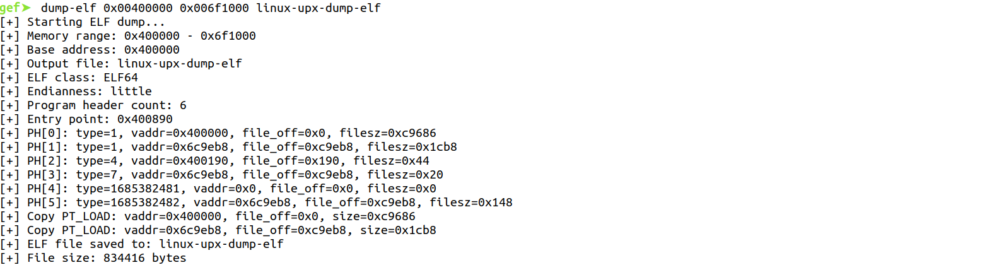
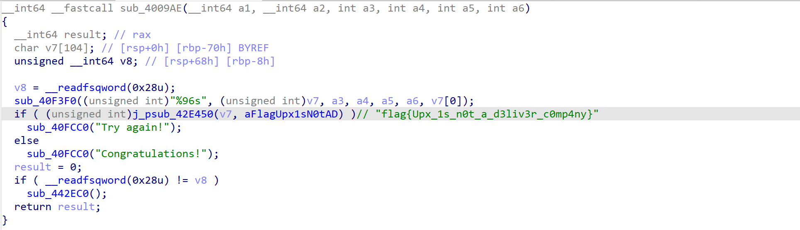
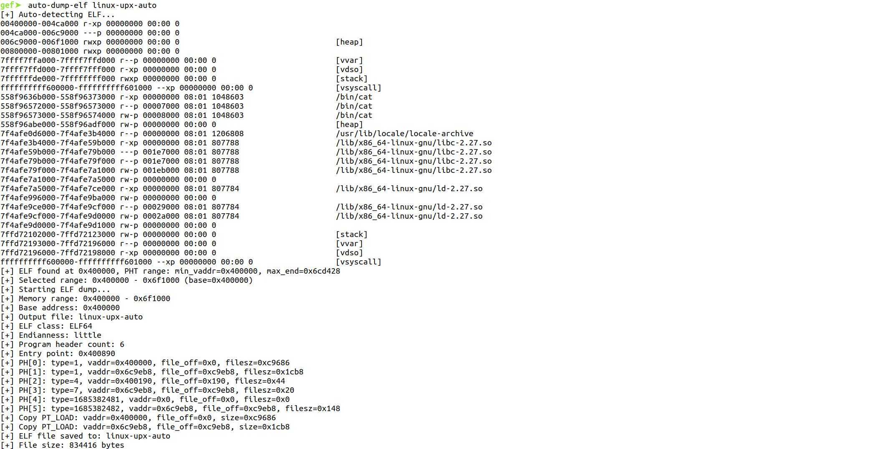

# Translations

[中文](./README_zh.md)

# GDB ELF Dumper

`ELFDumper` is a GDB Python extension that reconstructs and exports a valid ELF file from a target process memory range. It parses the ELF header and Program Header Table (PHT), maps virtual addresses to file offsets, and copies data from memory to a file accurately.

## Features
- PHT-based accurate reconstruction: copy `PT_LOAD` segments using `vaddr/filesz/memsz/offset`
- Auto range detection: `auto-dump-elf` computes max `vaddr + memsz` across segments to cover multi-mapping cases
- Sparse memory tolerance: gaps or unreadable pages are zero-filled to keep output structure intact
- Supports ELF32/ELF64, little/big endian
- Robust mapping sources: `/proc/<pid>/maps`, `/proc/self/maps`, and `info proc mappings`

## Requirements
- GDB with Python support
- Linux target (requires /proc or `info proc mappings` capability)

## Install & Load
1. Place `ELFDumper.py` in your working directory
2. Load in GDB:
```gdb
(gdb) source ELFDumper.py
```
You should see:
```
GDB ELF Dumper loaded
Commands:
  dump-elf <start_addr> <end_addr> <output_file> [base_addr] - dump ELF from memory range
  auto-dump-elf <output_file> - auto-detect and dump ELF
```

## Commands
### 1) dump-elf
Dump an ELF from a specified memory range:
```gdb
(gdb) dump-elf <start_addr> <end_addr> <output_file> [base_addr]
```
- `start_addr`: start address (hex)
- `end_addr`: end address (hex, open end)
- `output_file`: output file path
- `base_addr`: optional base address for vaddr-to-buffer mapping (defaults to `start_addr`)

Example:
```gdb
(gdb) dump-elf 0x400000 0x6ce000 linux-upx 0x400000
```

### 2) auto-dump-elf
Auto-detect and dump an ELF:
```gdb
(gdb) auto-dump-elf <output_file>
```
Workflow:
- Iterate readable mappings looking for `\x7fELF`
- Parse ELF header and PHT, compute `min(vaddr)` and `max(vaddr + memsz)` for all `PT_LOAD`
- Use the ELF-header mapping start as `start_addr`; pick the mapping containing `max(vaddr+memsz)-1` end as `end_addr`
- Invoke `dump-elf start_addr end_addr <output> base=start_addr`

Example:
```gdb
(gdb) auto-dump-elf dumped.elf
[+] Auto-detecting ELF...
[+] ELF found at 0x400000, PHT range: min_vaddr=0x400000, max_end=0x6ce000
[+] Selected range: 0x400000 - 0x6ce000 (base=0x400000)
...
```

## Troubleshooting
- Failed to get memory mappings:
  - The environment may restrict `/proc`. The plugin falls back to `info proc mappings`. If still failing, provide the range manually to `dump-elf`.
- Invalid ELF header / Program header table exceeds buffer range:
  - The supplied range may not include a full ELF header or PHT. Increase the range or use `auto-dump-elf`.
- Warning: segment out of memory range:
  - Some `PT_LOAD` data is outside the read buffer; corresponding file content will be zero-filled.
- It's normal that the files you dump won't run.

## Tips & Best Practices
- For PIE/ASLR binaries, use the runtime base addresses
- For packed/self-modifying binaries, dump after unpack/decrypt at a suitable breakpoint
- To dump only essential segments, choose a tighter range with an appropriate `base_addr`

## Effect Display

### 0) Under Normal Circumstances


### 1) dump-elf





### 2) auto-dump-elf




## License
Provided for learning and research. Ensure legal compliance and authorization on target systems. 