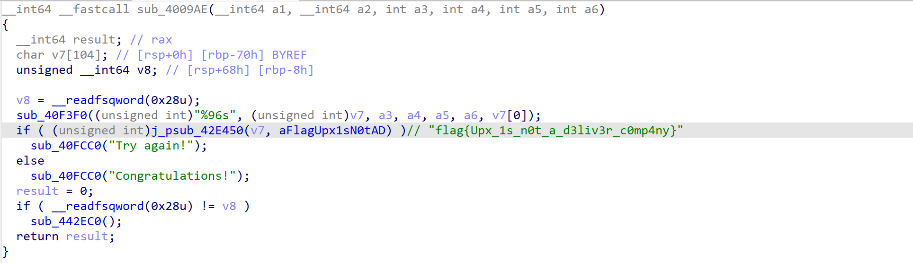
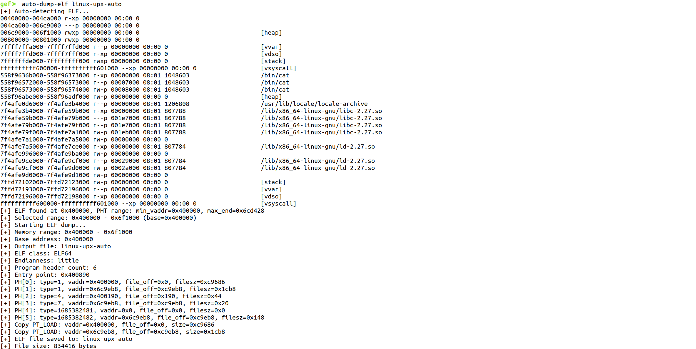

# 翻译

[English](./README.md)

# GDB ELF Dumper 插件（中文）

`ELFDumper` 是一个基于 GDB Python 的扩展命令，用于从目标进程的内存区间中重建并导出合法的 ELF 文件。它通过解析 ELF 头和 Program Header Table (PHT)，将虚拟地址与文件偏移进行映射，实现从内存到文件的精确拷贝。

## 功能特性
- 基于 PHT 的精确重建：按 PT_LOAD 段的 `vaddr/filesz/memsz/offset` 完成映射拷贝
- 自动探测范围：`auto-dump-elf` 通过 PHT 计算最大 `vaddr + memsz`，选择覆盖多段内存的范围
- 内存空洞容错：跨映射读取失败时以 0 填充，尽量保持输出文件结构完整
- 兼容 ELF32/ELF64、小端/大端
- 适配多种内存映射来源：`/proc/<pid>/maps`、`/proc/self/maps`、`info proc mappings`

## 环境要求
- GDB（启用 Python 支持）
- Linux 目标（需要 /proc 或 `info proc mappings` 能力）

## 安装与加载
1. 将 `ELFDumper.py` 放到本地工作目录
2. 在 GDB 中加载：
```gdb
(gdb) source ELFDumper.py
```
看到如下提示即表示加载成功：
```
GDB ELF Dumper loaded
Commands:
  dump-elf <start_addr> <end_addr> <output_file> [base_addr] - dump ELF from memory range
  auto-dump-elf <output_file> - auto-detect and dump ELF
```

## 可用命令
### 1) dump-elf
从指定内存范围导出 ELF 文件：
```gdb
(gdb) dump-elf <start_addr> <end_addr> <output_file> [base_addr]
```
- `start_addr`：内存起始地址（十六进制）
- `end_addr`：内存结束地址（十六进制，开区间）
- `output_file`：输出文件路径
- `base_addr`：可选，虚拟地址到内存缓冲的基准（默认等于 `start_addr`）

示例：
```gdb
(gdb) dump-elf 0x400000 0x6ce000 linux-upx 0x400000
```

### 2) auto-dump-elf
自动定位并导出 ELF 文件：
```gdb
(gdb) auto-dump-elf <output_file>
```
工作流程：
- 遍历进程可读映射，寻找以 `0x7f 45 4c 46` (\x7fELF) 开头的映射
- 解析 ELF 头与 PHT，统计所有 `PT_LOAD` 的 `min(vaddr)` 与 `max(vaddr + memsz)`
- 选择 ELF 头所在映射的起始作为 `start_addr`，并寻找“包含 `max(vaddr+memsz)-1` 的映射”末尾作为 `end_addr`
- 调用 `dump-elf start_addr end_addr <output> base=start_addr`

示例：
```gdb
(gdb) auto-dump-elf dumped.elf
[+] Auto-detecting ELF...
[+] ELF found at 0x400000, PHT range: min_vaddr=0x400000, max_end=0x6ce000
[+] Selected range: 0x400000 - 0x6ce000 (base=0x400000)
...
```

## 常见问题与排查
- 无法获取内存映射：
  - 目标环境可能禁用 `/proc`，插件会回退到 `info proc mappings`，若仍失败请手动提供范围调用 `dump-elf`
- Invalid ELF header / Program header table exceeds buffer range：
  - 指定的区间不足以包含完整的 ELF 头或 PHT，请增大范围或使用 `auto-dump-elf`
- 段数据超出内存范围警告：
  - 说明某些 `PT_LOAD` 的内存不在读取区间内，输出文件对应部分将是 0 填充
- dump出来的文件不可运行属于正常现象

## 最佳实践与提示
- 对于 PIE/ASLR 程序，请以实际运行时基址为准
- 加壳/自修改程序建议在解密后或关键断点处执行导出
- 如需只导出关键段，可手动设置更小的范围并搭配合适的 `base_addr`

## 效果展示

### 0) 正常情况


### 1) dump-elf




### 2) auto-dump-elf




## 许可证

本插件代码以学习与研究为目的提供。请遵守相关法律法规与目标系统的授权要求。 